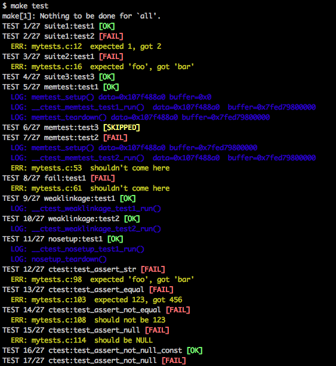

# CTEST

ctest is a unit test framework for software written in C/C++.

Features:
* adding tests with minimal hassle (no manual adding to suites or testlists!)
* supports suites of tests
* supports setup()  teardown() per test
* output format not messed up when tests fail, so easy to parse.
* displays elapsed time, so you can keep your tests fast
* uses coloring for easy error recognition
* only use coloring if output goes to terminal (not file/process)
* it's small (a little over 300 lines of code!)
* it's easy to integrate (only 1 header file)
* has SKIP option to skip certain test (no commenting test out anymore)
* Linux + OS/X support



## test example
```c
CTEST(suite, test1) {
    ASSERT_STR("foo", "foo");
}

CTEST(suite, test2) {
    ASSERT_EQUAL(1, 2);
}

CTEST(suite, test_dbl) {
    ASSERT_DBL_NEAR(0.0001, 0.00011);
    ASSERT_DBL_NEAR_TOL(0.0001, 0.00011, 1e-5);
}
```

NO further typing is needed! ctest does the rest.


## example output when running ctest:
```bash
$ ./test
TEST 1/2 suite1:test1 [OK]
TEST 2/2 suite1:test2 [FAIL]
  ERR: mytests.c:4  expected 1, got 2
RESULTS: 2 tests (1 ok, 1 failed, 0 skipped) ran in 1 ms
```

There can be one argument to: ./test <suite>. for example:
```bash
$ ./test timer
```
will run all tests from suites starting with 'timer'

NOTE: when piping output to a file/process, ctest will not color the output


## Fixtures:
A testcase with a setup()/teardown() is described below. An unsigned
char buffer is malloc-ed before each test in the suite and freed afterwards.
```c
CTEST_DATA(mytest) {
    unsigned char* buffer;
};
```

NOTE: the mytest_data struct is available in setup/teardown/run functions as 'data'
```c
CTEST_SETUP(mytest) {
    data->buffer = (unsigned char*)malloc(1024);
}

CTEST_TEARDOWN(mytest) {
    free(data->buffer);
}
```

NOTE: setup will be called before this test (and ony other test in the same suite)

NOTE: CTEST_LOG() can be used to log warnings consistent with the normal output format
```c
CTEST2(mytest, test1) {
    CTEST_LOG("%s()  data=%p  buffer=%p", __func__, data, data->buffer);
}
```

NOTE: teardown will be called after the test completes

NOTE: It's possible to only have a setup() or teardown()

## Skipping:
Instead of commenting out a test (and subsequently never remembering to turn it
back on, ctest allows skipping of tests. Skipped tests are still shown when running
tests, but not run. To skip a test add _SKIP:
```c
CTEST_SKIP(..)    or CTEST2_SKIP(..)
```

## Features

The are some features that can be enabled/disabled at compile-time. Each can
be enabled by enabling the #define before including *ctest.h*, see main.c.

#### Signals

```c
#define CTEST_SEGFAULT
```
ctest will now catch segfaults and display them as error.

#### Colors

There are 2 features regarding colors:
```c
#define CTEST_NO_COLORS
#define CTEST_COLOR_OK
```

The first one disables all color output (Note that color output will be
disabled also when stdout is piped to file).

The CTEST_COLOR_OK will turn the [OK] messages green if enabled. Some users
only want failing tests to draw attention and can leave this out then.
